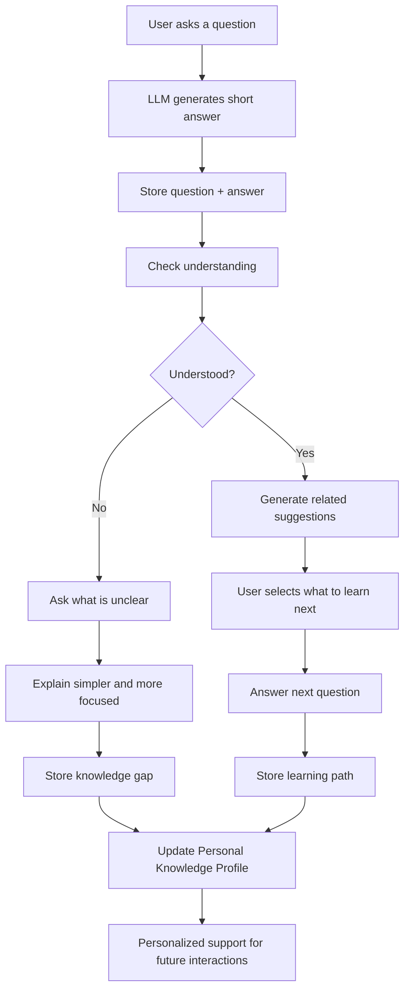
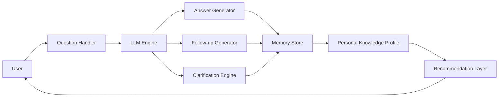

Tôi cần làm một project để thực hiện ý tưởng bên dưới. có một website đơn giản sử dung nodejs + express. Code được clean thành các file với nhiệm vụ rõ ràng, cấu trúc đơn giản không quá phức tạp để dễ đọc hiểu và maintain. Code viết được viết ra thành các component để dễ phát triển về sau. Sau khi hoàn thành thi viết thành 1 bản report về kiến trúc cũng như cách sử dụng.

`
Dưới đây là **bản proposal tiếp theo theo format đi thi hackday**, ngắn gọn nhưng đủ ý để bạn đem thuyết trình hoặc đưa vào slide.

---

# Hackday Proposal

## Tên dự án: **Insight Companion**

### AI trợ lý học tập cá nhân hóa giúp người dùng hiểu sâu hơn sau mỗi câu hỏi

## 1. Problem Statement

Phần lớn chatbot hiện nay chỉ giải quyết nhu cầu **hỏi - đáp tức thời**. Sau khi trả lời xong, hệ thống dừng lại, không biết:

* người dùng đã thật sự hiểu chưa,
* phần nào người dùng còn mơ hồ,
* nên gợi ý học tiếp điều gì,
* và làm sao để tích lũy tri thức cá nhân theo thời gian.

Kết quả là trải nghiệm bị rời rạc. Người dùng phải tự nghĩ ra câu hỏi tiếp theo, tự tìm phần còn thiếu, và mỗi lần quay lại gần như bắt đầu lại từ đầu.

---

## 2. Proposed Solution

Insight Companion là một trợ lý AI có khả năng:

* trả lời câu hỏi ngắn gọn, dễ hiểu, đúng trọng tâm,
* hỏi lại để xác định người dùng đã hiểu chưa,
* nếu chưa hiểu, tiếp tục giải thích theo cách đơn giản hơn,
* nếu đã hiểu, chủ động gợi ý các khái niệm và câu hỏi liên quan,
* lưu lại lịch sử học tập, vùng kiến thức còn yếu, và mối quan tâm của người dùng,
* từ đó cá nhân hóa hỗ trợ trong các lần tương tác sau.

Điểm khác biệt là hệ thống không dừng ở “answering assistant” mà tiến tới “learning companion”.

---

## 3. Core Idea

Mỗi câu hỏi của người dùng không chỉ tạo ra một câu trả lời, mà còn tạo ra:

* một điểm dữ liệu về nhu cầu học tập,
* một tín hiệu về mức độ hiểu biết,
* một cơ hội để phát hiện knowledge gap,
* và một vòng lặp để hệ thống hỗ trợ sâu hơn.

Nói cách khác:

> **Mỗi lần hỏi đáp là một lần hệ thống hiểu người dùng hơn và người dùng hiểu kiến thức hơn.**

---

## 4. Target Users

### Nhóm người dùng chính

* Sinh viên cần học khái niệm mới
* Người đi làm cần tìm hiểu nhanh một chủ đề
* Người tự học công nghệ, nghiệp vụ, kỹ năng
* Người muốn có một trợ lý học tập cá nhân hóa

### Bài toán phù hợp nhất ở giai đoạn đầu

* học kiến thức chuyên môn,
* hỏi đáp nghiệp vụ,
* onboarding nội bộ,
* self-learning theo chủ đề.

---

## 5. Value Proposition

### Với người dùng

* Không cần tự nghĩ toàn bộ câu hỏi tiếp theo
* Được dẫn dắt để hiểu sâu hơn
* Học nhanh hơn nhờ giải thích ngắn gọn, sát nhu cầu
* Có trợ lý nhớ mình đã biết gì, chưa biết gì

### Với doanh nghiệp / tổ chức

* Có thể dùng làm trợ lý đào tạo nội bộ
* Tích lũy knowledge graph từ tương tác thật
* Tăng hiệu quả self-learning và onboarding
* Có cơ sở dữ liệu để cải thiện tài liệu hướng dẫn

---

## 6. Innovation

Điểm mới của dự án không nằm ở việc chỉ dùng LLM để trả lời, mà nằm ở 4 lớp đổi mới:

### (1) Answer + Reflection

Hệ thống không dừng ở trả lời, mà hỏi lại “bạn đã hiểu chưa?”

### (2) Self-generated Follow-up

Hệ thống tự sinh câu hỏi tiếp theo để dẫn dắt học tập

### (3) Personal Knowledge Profile

Hệ thống lưu hồ sơ tri thức cá nhân, không chỉ lưu hội thoại

### (4) Compounding Knowledge

Mỗi phiên tương tác giúp làm giàu cả tri thức người dùng lẫn dữ liệu hệ thống

---

## 7. System Flow



---

## 8. Demo Flow

### Kịch bản demo ngắn

Người dùng hỏi:
**“RAG là gì?”**

### Hệ thống phản hồi:

* Trả lời ngắn gọn định nghĩa RAG
* Hỏi tiếp: “Bạn đã hiểu khái niệm retrieval chưa?”
* Nếu người dùng trả lời “chưa”

  * Hệ thống giải thích retrieval bằng ví dụ đơn giản
* Sau đó gợi ý:

  * Embedding là gì?
  * Vector database là gì?
  * RAG khác fine-tuning thế nào?

### Kết quả demo thể hiện được:

* trả lời đúng,
* hỏi tiếp thông minh,
* phát hiện lỗ hổng kiến thức,
* cá nhân hóa lộ trình hỏi tiếp.

---

## 9. Technical Approach

## 9.1 Kiến trúc đề xuất



---

## 9.2 Thành phần kỹ thuật

### Input Layer

* User query
* Feedback “đã hiểu / chưa hiểu”
* Chủ đề quan tâm tiếp theo

### LLM Layer

* Trả lời ban đầu
* Sinh câu hỏi follow-up
* Simplify/clarify nội dung
* Gợi ý thuật ngữ liên quan

### Memory Layer

* Lưu question-answer history
* Lưu knowledge gaps
* Lưu chủ đề đã học
* Lưu mức độ hiểu ước lượng

### Personalization Layer

* Xây hồ sơ tri thức
* Suy ra next-best-question
* Gợi ý phù hợp theo lịch sử

---

## 10. Data Structure Proposal

```json
{
  "user_id": "u001",
  "session_id": "s001",
  "topic": "RAG",
  "question": "RAG là gì?",
  "answer": "RAG là cách kết hợp tìm kiếm tài liệu với mô hình ngôn ngữ để trả lời tốt hơn.",
  "understanding_status": "partial",
  "knowledge_gap": ["retrieval", "embedding"],
  "followup_suggestions": [
    "retrieval là gì",
    "embedding là gì",
    "RAG khác fine-tuning thế nào"
  ],
  "preferred_style": "short_clear_direct"
}
```

---

## 11. Tech Stack

### Phiên bản MVP

* Frontend: React / Next.js
* Backend: Python / FastAPI hoặc Node.js
* LLM: OpenAI / open-source model
* Database:

  * PostgreSQL hoặc MongoDB cho user history
  * Vector DB nếu cần semantic retrieval
* Memory layer:

  * session memory
  * user knowledge profile
* Orchestration:

  * prompt chaining đơn giản
  * rule-based flow + LLM generation

### Có thể mở rộng thêm

* graph database cho knowledge relationship
* analytics dashboard
* recommendation engine
* lightweight fine-tuning với dữ liệu tương tác

---

## 12. Feasibility

Dự án có thể triển khai theo 3 mức:

### MVP trong hackday

* trả lời câu hỏi,
* hỏi lại đã hiểu chưa,
* sinh 2–3 follow-up suggestions,
* lưu lại lịch sử đơn giản.

### Phiên bản sau hackday

* hồ sơ tri thức người dùng,
* phân tích knowledge gap theo topic,
* gợi ý học theo chuỗi.

### Phiên bản trưởng thành

* adaptive learning path,
* spaced repetition,
* fine-tuned assistant theo dữ liệu cá nhân hóa.

---

## 13. Evaluation Metrics

## 13.1 Product Metrics

* Tỷ lệ người dùng tiếp tục tương tác sau câu trả lời đầu tiên
* Số câu hỏi follow-up được chấp nhận
* Số topic được mở rộng trong mỗi session
* Tỷ lệ quay lại sử dụng

## 13.2 Quality Metrics

* Answer relevance
* Follow-up relevance
* Clarity score
* Personalization score

## 13.3 Learning Metrics

* Tỷ lệ “chưa hiểu” giảm sau các vòng giải thích
* Số knowledge gaps được lấp đầy
* Độ sâu học tập trung bình trên mỗi topic

---

## 14. Limitations

* Mức độ “đã hiểu” phụ thuộc vào phản hồi chủ quan của người dùng
* LLM có thể gợi ý câu hỏi chưa thật sự tối ưu
* Dữ liệu cá nhân hóa cần kiểm soát privacy chặt chẽ
* Nếu hỏi follow-up quá nhiều có thể gây phiền
* Cần thiết kế tốt để giữ cân bằng giữa chủ động và không làm gián đoạn

---

## 15. Future Direction

Sau hackday, dự án có thể phát triển theo các hướng:

* tạo lộ trình học tự động theo chủ đề,
* nhắc ôn lại kiến thức đã học,
* tích hợp domain knowledge cho doanh nghiệp,
* dùng dữ liệu tương tác để fine-tune trợ lý chuyên biệt,
* xây dựng “second brain” cá nhân hóa cho từng người dùng.

---

## 16. Conclusion

Insight Companion không chỉ là một chatbot trả lời câu hỏi. Đây là một hệ thống hướng tới vai trò **trợ lý học tập cá nhân hóa**, có khả năng:

* trả lời,
* hỏi tiếp,
* phát hiện phần chưa hiểu,
* ghi nhớ tiến trình học,
* và hỗ trợ người dùng ngày càng đúng nhu cầu hơn.

Giá trị cốt lõi của dự án là biến mỗi lần tương tác thành một vòng lặp học tập, nơi cả **người dùng** và **hệ thống** cùng được làm giàu tri thức theo thời gian.

---
